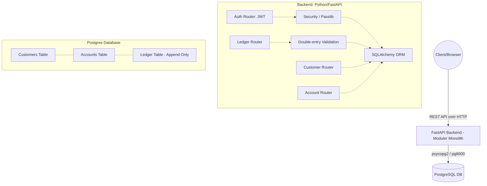

# Rykard Banking System



## 🚀 Proje Hakkında
Rykard Banking System, modern finansal teknoloji (FinTech) standartlarına uygun olarak geliştirilmiş güvenilir bir çekirdek bankacılık simülasyonudur. Sistem üzerinden hesap yönetimi, güvenli fon transferleri (EFT/Havale) ve yönetimsel denetim loglama (Audit) işlemleri gerçekleştirilebilir.

### 🛠️ Kullanılan Teknolojiler
* **Backend:** Python, FastAPI, SQLAlchemy
* **Veritabanı:** PostgreSQL (Güvenli veri saklama, ilişkisel bütünlük)
* **Frontend:** Vanilla JS, HTML, TailwindCSS
* **Altyapı:** Docker & Docker Compose, GitHub Actions (CI & Test Automation), Vercel (CD/Deployment)

### ⚖️ Double-Entry Ledger (Çift Kayıtlı Muhasebe) Mantığı
Finansal işlemlerde hata veya bakiye tutarsızlığı olmaması için sistem **Double-Entry Ledger** sistemini kullanmaktadır.
* Bir hesaptan para transferi (Debit) yapıldığında eş zamanlı ve zorunlu olarak alıcı hesaba giriş (Credit) yapılır.
* Transferler tek bir veritabanı "transaction" döngüsü içerisinde bağlanır. En ufak bir hatada tüm işlem geri alınır (Rollback).
* Bakiye bilgisi doğrudan güncellenmez; güncel bakiye, hesapların Defter (Ledger) tablosundaki borç/alacak geçmişinin toplamı (Aggregate) hesaplanarak bulunur. Bu sayede manipülasyon imkansız hale gelir (Tam Immutable Yapı).

## 🛠️ Nasıl Çalıştırılır?

Projeyi bilgisayarınızda ayağa kaldırmak için **Docker** (ve Docker Compose) gereklidir.

1. Proje dizinindeki `infra` klasörüne gidin:
   ```bash
   cd infra
   ```

2. Docker Compose ile tüm sistemi başlatın:
   ```bash
   docker compose up -d --build
   ```

3. Sistem hazır olduğunda test verilerini yüklemek için:
   ```bash
   docker compose exec backend python seed.py
   ```

## 🌐 Müşteri ve Sistem Erişimi

Kurulum bittikten sonra:
* **Müşteri Arayüzü:** `frontend/index.html` dosyasına çift tıklayarak tarayıcıda doğrudan çalıştırabilirsiniz.
  * _Test Müşterisi:_ Kullanıcı adı: `johndoe` | Şifre: `pass1234`
  * _Sistem Yöneticisi:_ Kullanıcı adı: `admin` | Şifre: `admin123`
* **API Endpoints (FastAPI Docs):** [http://localhost:8000/docs](http://localhost:8000/docs) adresinden interaktif dökümantasyona (Swagger) ulaşabilirsiniz. 

## 📁 Klasör Yapısı (Monorepo)
* `/backend`: Çekirdek API mimarisi, veri modelleri, güvenlik ve JWT yetkilendirme modülleri.
* `/frontend`: Son kullanıcı (Customer) ve Denetici (Admin) arayüzleri.
* `/infra`: Docker, Supabase ve operasyonel altyapı ayarları.
* `/docs`: Mimari yapıtaşları ve güvenlik stratejileri (Security Notes).
