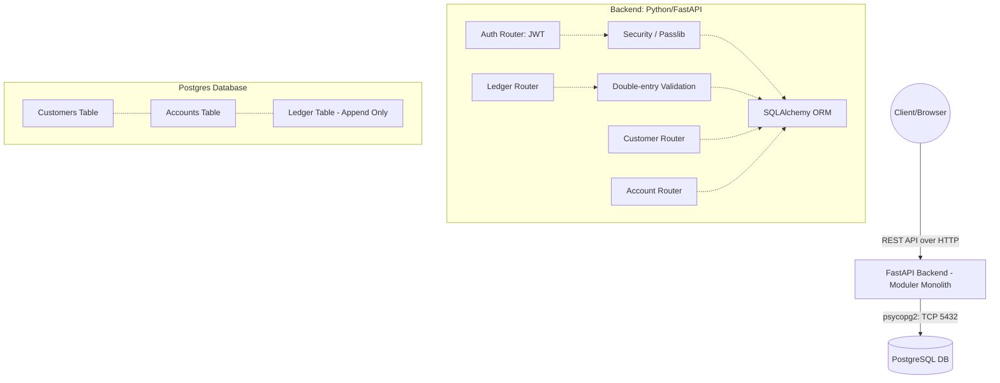

# Modern Banking Architecture

> **Note to user:** You can copy this Markdown code into any Mermaid Live Editor (or GitHub) to view the graph, and screenshot it to save as `architecture.png` for your assignment!
